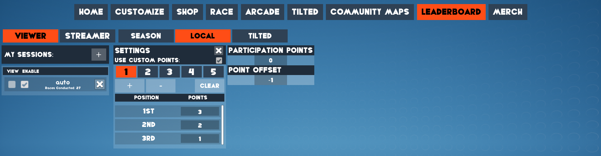

# Marbles On Stream local leaderboard parser
This code uses the gvas-converter library from https://github.com/13xforever/gvas-converter.

It is used in conjuction with https://streamer.bot/ and StreamElements to automatically execute the !addpoints command for the top 3 participants in each race.

The way it is set now, 1st place gets 1000 points, 2nd place 700 and 3rd place 500.

Unfortunately, the code is not very flexible, so if you want to have different values you need to edit and compile it yourself. The executable code is in `GvasConverter\Program.cs`

## How to use <br/>

1. In Marbles On Stream, go to LEADERBOARD, select LOCAL and create a new session with any name or use an existing one.

2. Go to settings, check "USE CUSTOM POINTS" and assign 1st place 3 points, 2nd place 2 points and 3rd place 1 point. (Make sure "Participation Points" is 0)

Example below:



3. After that there should a .sav file in `AppData\Local\MarblesOnStream\Saved\SaveGames\Sessions` with the name of the session that you made.

4. In Streamer.bot import:
```
TlM0RR+LCAAAAAAABADtWFtv47YSfi/Q/5DmuQqom2UV6IPjbGw5iTe+26r6QJGUrDUl6uhiW17sfz8jyU58yRbbomiKYgM4lDjDmY8zQ80nff7xh6ur6zVL0kBE179cKT9XExEOGdxdt/JMPIsgylqcC3JdCzHJQDkF+W/l/dXV53oAUUDLVR5rYk1lhmQqmEmaJjPJbWiG5BmNBjFc2dVwo7ZVLfpfzvLSW5Rz/jrLIuxyVtrLkpwdzW8Jzym7T0TYDdJMJAWoeJinRzoH+FYUZAHmwY4lR/78RORxKT6aw3yDi3SYR5fGEhxREbaqTV9KiYhIniQsyi5lF4E6CValssZJUO6zv0ec4jV7hbVX4VV4rtu/OM4khVQ5znPbcVpxfIcz7DiPgmDuOE84AUPpx2iUJQyHjjMCW7QeOmAelo1YWuYZrjAk9gacnfmq80cNvemV+XNdz4P86UTCDDckSrGre6qBlCY6W7hhgb8sQ4Bu0KkkK+ISvayop/OHLJxk/Y8yXwOMKNuWbl5nv/z8rcGFXEGlZ8fF8IcRvhObiAtM4bbPNlee4JQljuMFURnv9sGa43TWOH25vWHb8xTWYW2qClIUoktGw1AkDZuuhLGqS7qnYaqpMmoi753DKn9LWA+n6wwrZSlJgnh/TM6lK8biFg/W7OKYVOKEeQwOEWFnp6USlmmZAUSxgUw8BSQRqfCym/6HsePcJ4BmI5JVQ3OctXaDblSkyqbjhCkRCQ/cG8r5KZa/anFUpBkLK3vH5n4/3YlbZKwtaBUhOu/Hbkj8icp3tDPNPm7Qw/nc42oYL2Y0d9U+wrP+rtS5G8QbOuulePbkL5TtkqhP/kC+tUYzHeZ0DnLjbiB6pDsN3A7/ZHV6a1fZ+MP5ki/UKbJHflzKGdhqD7iymFs+6fbWC2W6I0XLtO5vC1fpc7CbT9ThkkQDsZj3IiKnwUIxcxpOC8BWWBzl0445pt1eiVk8jDb+QY8o94o96tFHPlyDjQJwRQ/tVfyx9rkhofnJnvd3j5wu8XzYcdXePetwEK4q7O15j9PutHCDW0SiKa/WzVG/HcHP//XXs/qJE0ZEGAf8KwVEGcfFKMPJ5XO4kpcP1iFLc56NxXT/XPi65onOeSnXpxnrUBWKLEuy7DXgIQn/mobLJMNgTd0zaFORzT97ms3y7+88z8rReT5c/n7eoDqli+rcHYmI4BzHKaNH0lp4eDCcd30T6wQ1TE9iiJiSpkPXx9SgEiOGLJvEMFSk/SNd/5ywnMTxe9P/WtNvIuI1kQ6ZM2RJUxVVcgkjkqohGbuoYXj4T9fz96Z/rcs6hn4PNKpJXUmjZkNyDWZKhmk0mdFwiWG+d1i/N/13aPr8+Z3IQGwHraNmv1y6IeXTLt+80cz95zHyrVVfLODeng2Ch0Flo27g70IsVr1Xf/p8MeNoGJoF7DWmbf9Fh4b3hdWZarRdYVrSjp8PlSkadnhhz/oIyIg+Du8ze7RckpDuZkVvt5jb/BLX6rBXzroD/3l0W40PxW3L4lsVsOX2vLd7jIbgy9rrroDArIDg2EsS3KZ43geMPLVHgKXCpE9cuY9IyHO7eMUMtpDVgZiPWtvDnA17s2f3n3C7Jcg+FlZnC9gmPp5pJ/X0uLJjtzPJJ+F0aX8odaa7B9CFdR0823LYyx5XWo8Dfjf54OcTZZrbH2TIWX9pKxMBNZTbL/te9V588KEgpe1SXugT3O3xxWwA67fcnrfE07i1eWq/xMvcj5VvIIEFkEA+mG3TaRWDZRnH1GpbwcO4xuPVtcXdbp/XBDE9juMLobTukD95rYEx7dwXYO+Qx0+uoiuQE2TPrWA+Oo31Y/v2W/P9DQQWVfggJojOe7nVHRZ0Nqlk5V7K37+dxBqKSUyiNSVDLd/0iaFLTVWmkud5OryuGkxRlP8miS2HWrNmokdLYVkYAv978wtXKvLkomGhN2DFLAmDLGO04hZnwF6Eb8Kuc6NQxjy30ZDMptmUNA+y5CpYkWTiKqpumLriHX0uOIrkGSENooo6X1DqsO5X6Dhc1b5L5z/BRY55EAXZ9Xmorb/ykY8IIFJArVqvJk6ZP9B1vKcRR5ACPxIJuxVZixCRV3z7dBdx+ekyzdqlEDjeG1T9IEAXi8rMfHVh/ios8/P5y5FNnLIRi9Ige4vaXPtcuJi39xs+9VxbfUvy1guKD68h2bg+Vui4cH/84cv/AY9WRtO6FQAA
```
5. Go to Settings and then File/Folder Watcher add folder by clicking on the ... and find `AppData\Local\MarblesOnStream\Saved\SaveGames\Sessions`, Filter to `"your_session_name".sav` file and Action to PointAlloc.

6. In Sub-Actions set `%save%` argument value, in both Initializer and PointAlloc, to the full path of `"your_session_name".sav` in `AppData\Local\MarblesOnStream\Saved\SaveGames\Sessions`. (Make sure that it's not surrounded by "")

For Example:

Wrong: `"C:\Users\PC\AppData\Local\MarblesOnStream\Saved\SaveGames\Sessions\mysession.sav"`

Correct: `C:\Users\PC\AppData\Local\MarblesOnStream\Saved\SaveGames\Sessions\mysession.sav`

7. Set `%converter%` argument, in both Initializer and PointAlloc, to the full path of GvasConverter.exe file from the [Converter.zip](https://github.com/SyrDim/MarblesOnStreamLeaderboardParser/releases) that you downloaded. (Make sure that it's not surrounded by "")

8. Edit "execute code", in both Initializer and PointAlloc, and add System.dll in the References tab at the bottom, if it's not already, and compile to see if there are any errors.

9. In commands, enable !manualinit if it's disabled.

10. Initialize once by typing !manualinit in twitch chat. (This should create 2 extra files in `AppData\Local\MarblesOnStream\Saved\SaveGames\Sessions`, a .json and a .txt)

After this, it should update automatically every time a race ends and the appropriate points will be assigned to the chat members.
