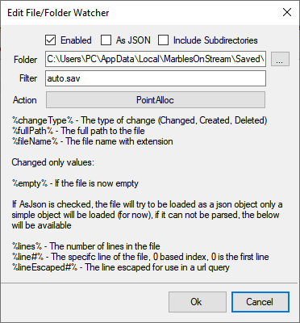

# Marbles On Stream local leaderboard parser
This code uses the gvas-converter library from https://github.com/13xforever/gvas-converter.

It is used in conjunction with https://streamer.bot/ and StreamElements to automatically execute the !addpoints command for the top 3 participants in each race.

The way it is set now, 1st place gets 1000 points, 2nd place 700 and 3rd place 500.

## How to setup <br/>

1. In Marbles On Stream, go to LEADERBOARD, select LOCAL and create a new session with any name or use an existing session.

2. Go to SETTINGS, check "USE CUSTOM POINTS" and assign 1st place 3 points, 2nd place 2 points and 3rd place 1 point. (Make sure "Participation Points" is 0)

Example below:


3. After that, there should be a .sav file in `C:\Users\<YOUR_USER_PROFILE_NAME>\AppData\Local\MarblesOnStream\Saved\SaveGames\Sessions` with the name of the session that you made.

4. Extract the contents of the [Libraries.zip](https://github.com/SyrDim/MarblesOnStreamLeaderboardParser/releases/latest) to the `dlls` folder in your Streamer.bot folder.

5. In Streamer.bot import:
```
TlM0RR+LCAAAAAAABADtXdt3qki6f5+15n/YZ7/OuBeiJDpvaqKi0R1FwXDSD9xEYnFpAW+9+n+fr6oAUTGCSbp7zpm9FmsnUFR9t/ouvyoqv/39b9++fV8bK99yne//+sb+k9xwFNuA374PlJWKDP+nIwQrQ7G/PbuWE/jfaSNFC+AlH9r9L/7927ff6H/wyNLx26qh16p3ClPilPJdqaoYXKnG1ealKjtXjLuaUa1VWdoXeenX0AjxqE6I0OGu4ShAAu4vWIVG6v5WQ6FutFeu3bX8wF3toMlcQX6qTcwG71iBpSBrb6xS45krN/SucUlaKmij7Pxx6JwPsVIc3bUbRBTnTzXX0cLVynCC82dn4jsSIWmyVlYW5n4Y8eEra+NAVtQEEaF9b/3r9XXqgyJfX59br68Nz3tQAuX19cnVFPT6esLj66sAfen0vw50D68Jho+tAH5SwsD9AYOdjIVvT3aecaqLlMrnGsfq1bJRqijVaqmqspWSMmfV0p1SuWOUap2dM7WTXjeGZS6wfJgfzPGTgI5VZivH92PFHRnKe8ZCCXR0Y4uHOdz9/Z+XJB9bzgmtuuFrK8uLlH36dGkYXgNZa+NM2eTxypgbYAqacaJz8hCrTwIS3Q3If2BpK9d358GP4ePk9bW9Amo27mp5V319XVd/MD8qTKVcf321fc1dIUv9oSN0TMutPQo7PzDsi/2lDOzB3TjIVXT4lflRhh6Yb6GnKwE2qrnlYJtruQ54lsBYvb521orfdle2Enx+3xHNLXdlfH7njhH4AcxxZaV/fucHrbSEhbLyyAjpAX45tiB1FxgtVyeWqc+Gnmpr5rSC9npHDH5umP7pvacles6+P/ZeJD1UK0NGkYb7dJtxRV5ojLzW7PJCb3ETedaDtlvPsNvQth6m205ssaJ36qHG1m1o24f/w8zx0BgZ3dH9w8graywK5V1zYsyGjCwx4Yit+2pHfNM7aK06g3DMiiEZc+8PW464VyTO4dtDTquMkSpwj4bELVQJveFxoL+NLvV8RRqYL+x2oVUG5qjc5AWJg3scgucwptvTuqKldtAb3+mtVXZjjmcL9FIRGVkwPfzcgL5aI9TV7fZ+bNd3qtRmnpY6+zIbmBrbZuUJ0GIuezFf/S7IyGru9W4PvUiM+Sw0O4q0RU/L+kaWqu7LrOdoZd8i7wo9HfhfTyvjHeal31r6/KPsAc9DlR3H78T3mi/sEAEf4dQWF3ILaLWRL4tD3Cd6Qni8kdcfYXqXPdp/o863xfaUFaH/tq/MPKRZnCBL7WW/O2Q06EcVllgOhIenXf1BZbm9ygK9SN8pszGadEAngmmBLkLdFnd6h+iIUXfNX7FOn6xqyFukj15rRngn9/kHxhSc4VpdwuXISHNGYZqOCdv7VZaGDNCx0O2pz3c4GLFJ7OSIXjREencMstX3Rmx75HeNyFat9IKX2ZjB8gObDuWOGIJdLec5+ZqCnIgddTx4XsX8WP3P1anZ3zWsJ5v0bz216LsTqb6UBe4B60DvTM90LFZ6Xur+ROm0d9Ce6k5YZtFX0WzEyDMe0wfzBM+x8Q7aB7QvcXfQ+cZUYX6CbUzHb4u2ag/XMtHrwob5vJeFZWJHevRuLLc+lZP3c0OfU73jfoldEN3L2C6x7WGaK0OVd4iOrZnATdVy3Nb0+JZv8hZH7eXNx3qCeTr0ZLZqRvJyMZ1PFXEjd9rgE0Ye38HymJoa/K60iB1ivWD7UGdCg8hFi2QPbam9gD0UpIkBn2T93CzXT2x7D37JUa1GqHcXDN9a4LaBKonLJ/bQf2Q/79CnUVkRuSJPthouPyVtQ/A5HtC875/Ru/SofKk9toTams795hvYMwu+EMvEVPA8s5o2tis6Bkp8KbXZMrEbbBuyMzixX24qzxYM1StH+ojtP6XXnTwbltXuCL9raztqh2KnDrYzcpP2krx/Wg59iB0I7D6Zf6l+1soOdNDirZ+7hsm3GibonAWbK8tCcy1bzY1mA03AlxH7sUSXXIB9Cm/x9/g9uEA32N9PTZV9MbVub62BnerdZUQLlACt5kbttDnob4/fHTz48ZjRfR5iQ72sOiP6znQLehjV1Mg3PVvNJfiWReyrNEw78VOmR+mvrSF27GEcTDvIeejy3ab/MkPgZ/U9/LxTK03wfWNPng1gjGhO2e0d3xmDnh+xPInPS/xri3sEWSOQ1wL6vpOndUuxIQY+bJdxfHu2FrE+judhZFd4rrwIjQX2A7q09eO5bERtQTY23zIXsWzBb+4njuirj/XdWCpvQIZuip7U/FgQeTyhNF9DddBmwmks/w7wXvY3MK96OL5ru4MvSex4FPnkioh1xCgwX8BG17rEMXynbicydAZJexliL9jcm9JquER+WLb7R1ORqibllxvFtqNI4l7aN/UsOgXwYepsQOfVCU2tWTLuqr8/3J+PcD4RtYc5KEd5APiSEOYinjM+1Wf7+cX2IH8Yg+518Jsm2CbnGwLlEXzZG9Cxh3jB8djf2jWYj5B3CNRvJmNI2A+IixfWjH07zIvaFr8T2U2WvM/5X0I8kMr7RP4jdJ+MMUKQw/BUdrGNtWL7braNbnOh2uN1EqchjuGcR5hCfliB+AtzT3OWtcSGYA5Q3kf/iG0SXwrR6RLsvBEMJilZZ/JY3wyspqdG/B7rL6WzIz5gDMFfpcdsSfUVnu/EJzz0VB7JC7UrIh4xR++pNonldFzkWxO7HeD4fdwXnisLD/qr8w8Dc96F2Mn65vOEMVU8Z0Au1BdBjMA2Khx8GNZDYgega7BbX5ewrXNLvtWbQ56zIPlOp+6pDtiMmRp3hLCPx3lNWU7LbYSOfNLTEvx6axGSmM76Xpr2+ejw85Geu4NwJI2X/SObHaXeRfXEd9O5atM8a2Se9GPqnVocf8BeRibNF6bkPolhB9sj9kbaotifgL09krjzEMezJ5Th+1qLEz8c5S/03VQdIu5ApgzJUSvD+zhfpzkrHusofwyhFlhC/IM5Mq73UzImebXAzUg+NW37apvUKG4876E9iZNg82TeJrle0geRH5U7zqcy/F/+MRqWTH2ydd4/+d+M4qHJdxma/9ggg1kv5LvjHdgbsXlsC/g6wSW8laG5tmehbORGN5CyEwJldQ5SkecYdRobfoiCiStGiNTllkdtThESChKxXFWpVY15STe0u1L1/t4oqfdsuXSvcXcMV5tXWeMU5roKEtXxv8+EicopmCj+8ZdT9K6DhyBwzi9p0A8hxfMNPfWUPozxplOgtGJUOY2plku1WkUpVZXqvFSr6FqJ5Ti2rLJK/Z6p/CFAKUE+Gwi52n8UTvphtO7cDP7fgXVUp8aq6Qavr9Cl/7Wg3dDYBKBVzGTPd53/ooL/RQX/oqggqbZi9OeFXUAGpCOxizZZKBDOGPnl0IXsz4Gq3aJZeZzJXkEYrcYhypNIH/HZWpCsSouQHpz1RpnFM1QHYT9GO2y5rHa2I8iiXMiCQ6jcJxEq4faFCEmcltdyZxpOIONWrfhe++2FFfdxxR+jV1PgVbOnERJJUIpj+qKrMAp5yidU2LgSBTtJZUtboHvq8gmySNHAQyaKUTyeZLOn9NDKmyA1WZV3OpOMs2KX8vBVGec5jTehlV9qH40V3+JDKlv+BKEe4n4ZWTizF6or4TJKfaabL0Yzs+wTqjMiX7DHiN4FyegzZUqvDFlfQT/zy/YeowsvsyHoTg/5FkVG+6Qir5c1Uq2Jy75AkT4eKnRcWWK7j6twqcyY53MxQSDN0+oC20Psv2RczbZJn380Knpdxh2KWEW22zYw6tYdnFVLBBk/089FXa6fysQeMQoYrW4kNCfVa7bdJHGG2qCI+8F2hNFRMu8Jskt8KY1lLtGxTe5n+qYTW7qOuGbyRNo+qJ36HscqGvMu+OYEWaVoyRGyWokQE4rGxSgMd72vAihtNv2e6ozATrYLQxJ3RJYPjfs4FsT3+c6QoIWX6Jlg+3jYJojUGToHNGKfgVHqyOdCXBpS9LFDUal4rB7kCFoabXtHpp+N7GbaSOPCfTJHKFLCtx4xkgd+Z3MxNhuX+o/0QFYoEuSe62kM7m/7rC3FQOuOuf7jYWUv7dNuQWMz521uWlNxMw+i/M44VI6fj75eoz0Pf9Q/nCDU13ghiFAu2SUIH0Enib/enKN9LML+G/zYluO7Y1fGsVnCK5ZDjAab4ANs8O02yCKI/Oh/uLwJPUfoY+w7+EexquEVgE49yRUhNi+0XbM3htqB1CfgD4zJNo51PthiNOer95fm5el1hqBfkyedv1ifdEUqzgEJGs6TFRP88+BEhnnkRmWSl4aI/gidz9seaKerhCTuNHbSrifRFUKKzBfoJ1SFo35+gk+IVwFy0x/51T9sBSA/f/QiuQvMlQjpLcDXEfofrQhwwROR/zJ3X/O8dnMSg6OVi6O59U7enbK/4j7tllWLa/0fakkujn25a8oTer5q98u1+UF3AUQ15kja+mJHrOqtRSS3MZJp3u6f8Hk5N6H91t8duyP6Gjv9cLy/eQXlnXEv2jK2ubO6IuPeJd7eq0EqtAYhdjejtvliT/G8DjRcQ0qjS7nyxV0eoD9PTnYrLFJ16TLJpfUZiWtITnZJ8FdqnszaBGwSObSuH09VRgzllvlOfXOxboIaX7cVIaH51Aa91I6Rtdo51AhRbXlJRknti2M2jLnXpW0Sw2V7STGs9ng9Bp8c7VrJtA0q0+PaKtu+gX5W9s52wlyjD8cUoWHxbxdruxQvzLW279RRkd2xxOec74R5pz8iw+w+ob+6n7alK/0lvEBOGUK/O4g7e4gBkDONfJxbKrPe8rId6fAuB3aD4/sQ4Rgo490L0XtxDfoZ9eE7ujvsoBAyVrKXYNcZOx6fO2MO8sJAkQb/6MO81Sqir79jd4r0YvajmpI/5ByXaHrf79NcBs+1wxzGuLRNazre+ngdRuhttWP9Qo03/Il3IU0qvbY6azKGsEit9qcw8ltyfeEy9pxbJqnrtIa86COFZnOyHJlfsBMowfly10+Ux8x8fyCQ3TS37NrKO26xnLNo/Zq6DthKkrMm2PB4ttjgnFpl4h0jpgc62fOP6FGRhmQdCsv6OYlhOIeP5uNFH3rJvm+px+iVuYsNahNS69Idbcc6ya2H/PPzjJ/C9Rm9aLw67J4SaW1jzQrKhFwRbpjs2FoSzPDGvv7a9RqlEWNnkMc7IrpF9se79rim3Bm5kBNgfGGVq4ZKXbnrN3Kd7oilYx/TU6x2LOCb89dzkd8GefiRX0Z5x/nPr+vo9bFdbMXxsYF1Yw5UqLY8m+fx2Ee7nfPRXtx3Y7+C82BSp+DcF8eB1C7zn7um19/5OXKS2+k44x0FHsTteeKTqN8rRkPa/qN8HPtjYs+TnqqITDhjxp5WIfGb4Gg3+S2yHts87FKP+y431ziu4poC4uoutw7PZJmqBWg+uZNYpD+h+qMyGxI9kV2+N8UVUtun8/G475EKMsN+CMeYwZW1jMsXzg3R7rNpz+3fs/CMbDqJ/hI7wWtNLd76qnmH9+fgXcGqPR6SnFnSoabmFy/SeKnFNt/izf6uWQEbCnGOjr+4iu4tNPCx0q5nQ12411tn+3Ly+xvKe7IPSewscC63JD4ajV2N7IXhJmpHRFrL3A4eGpv8sfgKZpa6iP0d7HxBcIArdVtqnGL5+uNwJOBYB/nPBHIjjW07eB8Kj3GmbjJnLbw/APw83rG+pHsF6L3Dl3HRs7P9D/njGbkO+7qmCsG86L6aWBdgJ74siZv+w+MG5J9ft0Vtv7PwNMgzcD3OW3wxX1tApvE4GfYc+Yrb7Pl9n/DH4Lc0z8JY2YfWy9NYRi7eqf8+jHsdU0nbSW7ftX5i6B6FaJ20AGZ5po/3anvMP8kDvsr/HmN+BWrF3HPqTFYHDCT5mi7a8/TY/jmm8vjctepu8oUprSPy5r9/wtr1LTq8SX/U9r70K7ECdBzy7hazLfju162F0/6LxbCIH6gTbnnvk9bG47l9+Qu4on1Rv0r3OQ92zdo8ojWpywTcrrZWyD7yHjr5OjaeryHMyfiLYFLL86gOsbKNa8Q4z7ZurW1uXiunsr/65V2BvnLne+T6rLXzw9j5fXO8n/MM+zmcAhHh35Hfxnv9tsuCMe6v/3VgPj4+tKZeDKOiNWLWSRvjjrjPwKdqcheFULt7L/uqeyzr/Hl4uv7Ns8/w9CqIUYP9DV3Q64pgHp30mmVvD3a3lMlaCbG/N6UjvikQ02mt19iT/AHH/IKxBuf4J2udtdTaxR+A74AtAg2ptYYNxpb4h81xPrb3CX5/C15yy1oBpe0d7InaQ5Rbt0+wnZtxkRt89RG9eD3PksFuIRYdrT3CHGcGe/4CFlWwNs0edyE7Y7pOfbxftgf5zH5A6xciyxMsqWA8ybbhF1sEXTGQJ8v0WwoSm2/VQ9qmU+vvn42zpa40XpjJS27c4z1evhAzLMLLzbhhmpfD/ofPxm5p/7lruo+9c+b/SJ17hLNjX/iX9YMfxOCp3L56jjWRCrZ/nY+C+NYZH189v/Ly8fhBPr5ubhVcgy1WO0DN9cIuQAc+3ruy0yojXJ9hub+RU4mKrIFFp1kUoPWWOgtyZR5yTBI/vfjkJqj90zkYXntb9W+JZbfkY5Su99atFpGPyozlt9rdzb4pohdjJiTWgAyPTnRigK6Hwe7COtaHcw8ybhzbLuRcZP8llqV4PFeL7l84vWh90kOgqwDqAht/K/op/pjylqwxAV9HvmbcQXsSj6Zk78oHc8f0WmMWLx/0yZSXeL/ln8zLB/0y5eVL1k5T/Rf0uTe8k38NquBaYZJH/GXWCg9rx+drhVGMOvsGuahfSJ0lQddmCc4Trxvi00i3SJ413MGksRkU3LOUz+5JPpLMsaJrhcV8f/Nh+mjiPUah/FgmaxwyO3V5qw18jzfx/gSQ9SqVj+Fvz+m9w6mY0bP/K+vkUc5WdI9CYZnG45zbc7SGe5s9X/EJhb9XMeNT4cBXzsZlza6aercXnTCHTxPz6n/xE8LUMsfdsXO2pOq1eqmq65VSXa/cl1hD0WrlWo2rK+U//YSwSp6D5E+P8J9bKz+4cIZ/mWFOSM9x4n5VURnVmM9L5TuVKVXvtDk+TE0v3ev3dYYz7jiV0z7txP1TbX3aeftnf+kA7NHRL8jp/gYxGSoLYjLUkmHUy6VqldNLSk3VShp3f1+vVDWVuftzxVS+RUzBwlpdkhJ3g5TmIKZy+Y4t1VimUqoylbtSnWWZ0l2F0e5q1XpFVbk/VUrsV5zKh/+jLenReqlX4TXbVhw986+c+G64OjsgjskgyzNWthUEhk7OBDshLHmYSTbVy329VlXv72qlWl1XStUKNy/VK3OlpICjrGvcXZmppPxhSpInZ+lZDjkL8OyMQJseH8akxUX4xoP/D/wQKshyrOD7qaj5W/7Qi+a6SHc3TuPQxfFRhsjVlOjUvhRJlum4K6PpBg1Nc0NyVOAxFx7+MzZ+0MIPjVXWKYPxA+bsJayZiy+Gh4dYP7/9nupT8Q3BcHwryPq7H99N5KoKakUMH49Me816kv/ERXOlOEE0qZm0Of/9b7//G9FAb8bcZwAA
```
6. Go to Settings and then File/Folder Watcher, right click and then add. Click on the ... and find `C:\Users\<YOUR_USER_PROFILE_NAME>\AppData\Local\MarblesOnStream\Saved\SaveGames\Sessions`, Filter to `"your_session_name".sav` file and Action to PointAlloc.

Example:



7. In Sub-Actions set `%save%` argument value, in Initializer, to the full path of `"your_session_name".sav` in `C:\Users\<YOUR_USER_PROFILE_NAME>\AppData\Local\MarblesOnStream\Saved\SaveGames\Sessions`. Make sure that it's not surrounded by "".

For Example:

Correct: `C:\Users\<YOUR_USER_PROFILE_NAME>\AppData\Local\MarblesOnStream\Saved\SaveGames\Sessions\mysession.sav`

Incorrect: `"C:\Users\<YOUR_USER_PROFILE_NAME>\AppData\Local\MarblesOnStream\Saved\SaveGames\Sessions\mysession.sav"`

8. Edit "execute code", in both Initializer and PointAlloc, remove all references in the References tab at the bottom and add all the dll files from the `dlls` folder that the Libraries.zip was extracted to. Compile for both codes and if there are no errors click `Save and Compile`.

9. In commands, enable !manualinit. Initialize once by typing !manualinit in twitch chat. (This should create 2 extra files in `AppData\Local\MarblesOnStream\Saved\SaveGames\Sessions`, a .json and a .txt)

After this, it should update automatically every time a race ends and the appropriate points will be assigned to the chat members.

If you want to change the amount of points that will be assigned, you can change the values of the arguments in PointAlloc.
